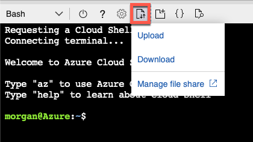

###  SAP Automation > V1.x.x <!-- omit in toc -->
# Bootstrapping the Deployer <!-- omit in toc -->

Master Branch's status: [](https://dev.azure.com/azuresaphana/Azure-SAP-HANA/_build/latest?definitionId=6&branchName=master)

<br/>

## Table of contents <!-- omit in toc -->

- [Overview](#overview)
- [Procedure](#procedure)

<br/>

## Overview

|                  |              |
| ---------------- | ------------ |
| Duration of Task | `12 minutes` |
| Steps            | `10`         |
| Runtime          | `5 minutes`  |

---

<br/><br/>

## Procedure

<br/>

1. Cloud Shell
   1. Log on to the [Azure Portal](https://portal.azure.com).
   2. Open the cloud shell.
      <br/>

<br/>

2. Ensure that you are authenticated with the correct subscription.
    ```bash
    az login
    az account list --output=table | grep -i true
    ```

    If not, then find and set the Default to the correct subscription.

    ```bash
    az account list --output=table
    az account set  --subscription XXXXXXXX-XXXX-XXXX-XXXX-XXXXXXXXXXXX
    ```

<br/>

3. Install the correct version of Terraform.
    ```bash
    mkdir ~/bin; cd $_
    alias terraform=~/bin/terraform
    wget https://releases.hashicorp.com/terraform/0.12.29/terraform_0.12.29_linux_amd64.zip
    unzip terraform_0.12.29_linux_amd64.zip
    ```

<br/>

4. Repository
   1. Clone the Repository and Checkout the branch.
        ```bash
        mkdir -p ~/Azure_SAP_Automated_Deployment; cd $_
        git clone https://github.com/Azure/sap-hana.git
        cd  ~/Azure_SAP_Automated_Deployment/sap-hana
        ```

    2. Checkout Branch
        ```bash
        git checkout beta/v1.0
        ```

    3. Verify Branch is at expected Revision: `58676615fcf5678a187d599629a9c7c6b121a966`
        ```bash
        git rev-parse HEAD
        ```

<br/>

5. Create Working Directory.
    ```bash
    mkdir -p ~/Azure_SAP_Automated_Deployment/WORKSPACES/LOCAL/NP-EUS2-DEP00-INFRASTRUCTURE; cd $_
    ```

<br/>

6. SSH Keys: Chose One

   Create
    ```bash
    ssh-keygen -q -t rsa -C "Deploy Platform" -f sshkey
    <return>
    <return>
    ```
    
    Upload using the Cloud Shell [GRAPHIC]
    ```bash
    mv ~/sshkey* .
    chmod 600 sshkey
    ```

<br/>

7. Create input parameter [JSON](templates/NP-EUS2-DEP00-INFRASTRUCTURE.json)
    ```bash
    vi NP-EUS2-DEP00-INFRASTRUCTURE.json
    ```

<br/>

8. Terraform
    1. Initialization
       ```bash
       terraform init  ../../../sap-hana/deploy/terraform/bootstrap/sap_deployer/
       ```

    2. Plan
       ```bash
       terraform plan                                                              \
                       --var-file=NP-EUS2-DEP00-INFRASTRUCTURE.json                \
                        ../../../sap-hana/deploy/terraform/bootstrap/sap_deployer/
       ```

    3. Apply
       <br/>
       *This step deploys the resources*
       ```bash
       terraform apply --auto-approve                                              \
                       --var-file=NP-EUS2-DEP00-INFRASTRUCTURE.json                \
                       ../../../sap-hana/deploy/terraform/bootstrap/sap_deployer/
       ```

<br/>

9. Post Processing
    1. Post Processing.
       ```bash
       ./post_deployment.sh
       ```
       <br/>

    2. Note the IP address of the VM.
       <br/>
       <br/><br/>

    3. Download the Private/Public Key Pair for use in your SSH Terminal Application
       <br/>
       <br/><br/><br/><br/>


# Next: [Bootstrap - Library](02-bootstrap-library.md) <!-- omit in toc -->
